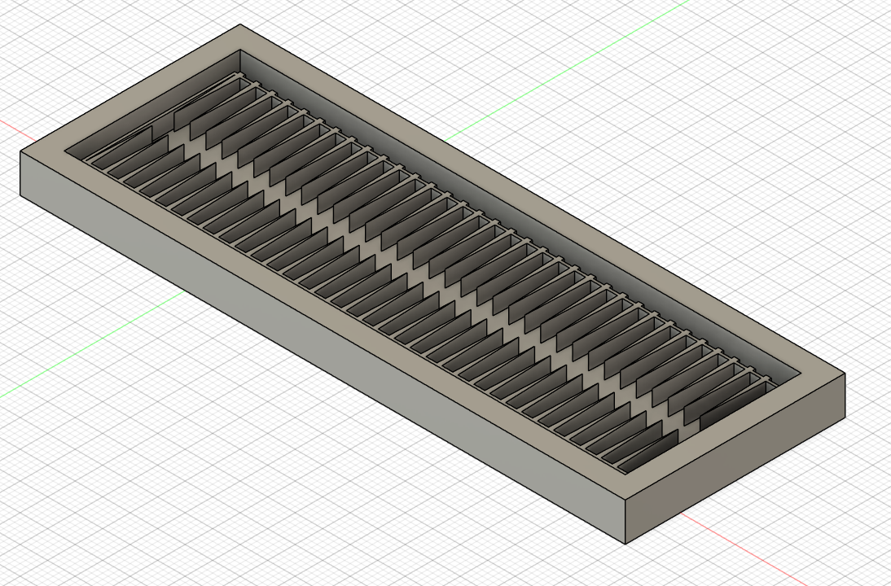
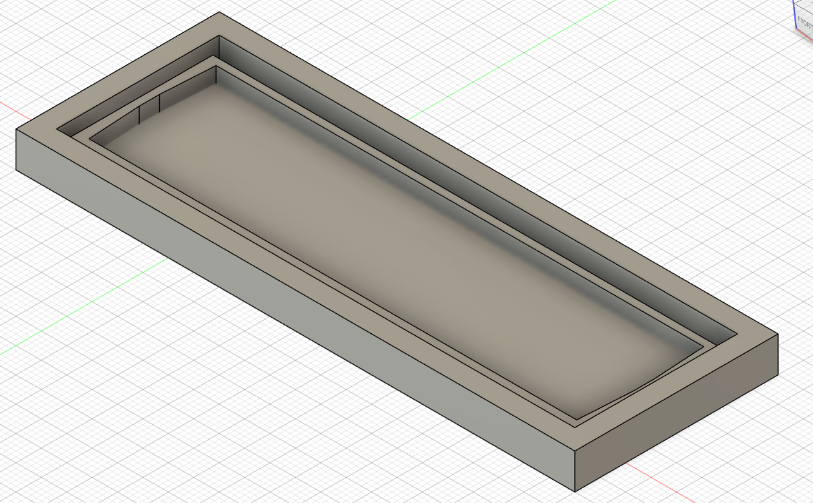
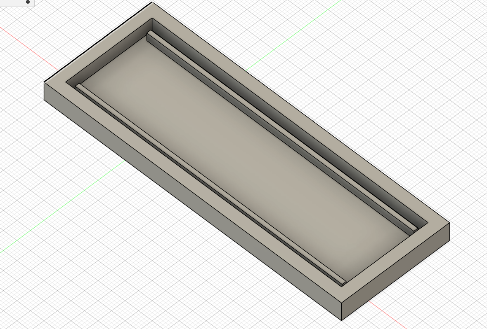

## Twisting-Soft-Actuator
Twisting soft actuator is a project that where different designs of twisting soft actuators were developed for potential use in robotic arms due to their advantages compared to rigid robotics. . Made for Masters individual final project.

---

## Components List

| Component                             | Amount | Total Cost (GBP) | Link |
|---------------------------------------|--------|------------|------|
| Smooth-on Ecoflex 00-30               |   1    | £33        | [Link](https://www.benam.co.uk/ecoflex-00-30) |
| Syringe and tube                      |   1    | £2        | - |
| PLA Filament                          |   1    | £18        | [Example](https://www.amazon.co.uk/s?k=pla+filament) |

Total cost: £53

---

## CAD Designs

Design 1

Design 2

Design 3

CAD .STL Files avaliable in the `/Final_Design_CAD_Files` folder

---

## Photos

More photos avaliable in the `/Soft_Actuator_Photos` folder

---

